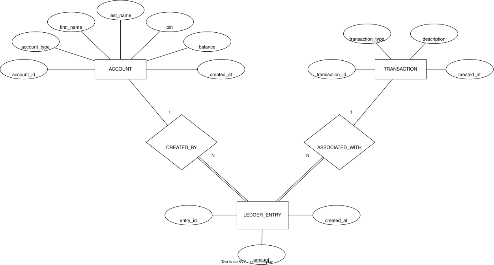

# Bank of CLI Project

```
$$$$$$$\                      $$\                    $$$$$$\     $$$$$$\  $$\       $$$$$$\
$$  __$$\                     $$ |                  $$  __$$\   $$  __$$\ $$ |      \_$$  _|
$$ |  $$ | $$$$$$\  $$$$$$$\  $$ |  $$\    $$$$$$\  $$ /  \__|  $$ /  \__|$$ |        $$ |
$$$$$$$\ | \____$$\ $$  __$$\ $$ | $$  |  $$  __$$\ $$$$\       $$ |      $$ |        $$ |
$$  __$$\  $$$$$$$ |$$ |  $$ |$$$$$$  /   $$ /  $$ |$$  _|      $$ |      $$ |        $$ |
$$ |  $$ |$$  __$$ |$$ |  $$ |$$  _$$<    $$ |  $$ |$$ |        $$ |  $$\ $$ |        $$ |
$$$$$$$  |\$$$$$$$ |$$ |  $$ |$$ | \$$\   \$$$$$$  |$$ |        \$$$$$$  |$$$$$$$$\ $$$$$$\
\_______/  \_______|\__|  \__|\__|  \__|   \______/ \__|         \______/ \________|\______|
```

## Screenshots




## About

- This repository features my first project built during my Revature full-stack software engineering training.
  - It is a minimal CLI REPL application using Java, Maven, JDBC, Junit, & PostgreSQL.
  - It features a fictional bank with limited functionality that allows users to create accounts, sign in, deposit, withdraw, transfer money, check their balance, and view their transaction history.
  - The database contains a double-entry ledger that closely mirrors real-world financial institutions to maintain accurate bookkeeping.
- Full instructions and rubric can be found [here](Instructions.md).

## Deliverables

- [Presentation slide deck](assets/[2026-09-25]%20Revature%20Bank%20of%20CLI%20Presentation.pdf).
- PostgreSQL Database w/ [ERD](assets/erd.svg).
- Banking CLI App With:
  - Clean code & multi-layered architecture.
  - Error handling.
  - Logging.
  - Unit testing.
  - Transactions (to maintain account balance integrity & prevent race conditions).

## Setup

### 1. Start the database

```bash
docker run -d \
  --name bank-of-cli \
  -p 5432:5432 \
  -e POSTGRES_USER=username \
  -e POSTGRES_PASSWORD=password \
  -e POSTGRES_DB=bank_of_cli \
  postgres:17
```

### 2. Initialize the database

Import the initialization script ([`src/db/init.sql`](src/db/init.sql)) into your database, using any PostgresSQL client of your choice.

### 3. Run the application

```bash
cd src/app
mvn compile exec:java -Dexec.mainClass="io.github.tthn0.app.Main"
```

## Presentation Outline

### Before Starting

- Turn on Do Not Disturb.
- Open Google Chrome.
  - Open slideshow in an incognito tab.
  - Move to virtual window `1`.
- Open VS Code.
  - Make sure project is open.
  - Open up terminal in full screen.
  - Open up `application.log`.
    - Make sure it is cleared out.
  - Open up `init.sql`.
    - Re-run the entire script.
  - Make sure startup command is ready (and copied to clipboard).
  - Toggle minimal user settings.
  - Move to virtual window `2`.
- Open Docker
  - Move to virtual window `D`.
  - Make sure `bank-of-cli` is **stopped**.
- Open Zoom
  - Make sure camera is on.
  - Move to virtual window `Z`.
- Close all other apps.

### Presentation Script

#### Pre-Demo

- Hello, my name is Thomas Nguyen, and I will be presenting my Bank of CLI project today.
- Let's begin by discussing some of the requirements for this project:
  - Authentication
    - Users should be able to sign up and login securely.
  - Persistence
    - All transactions must be stored.
    - So users can check their account balance or transaction history at any time.
  - Transactions
    - It's important to note that all transactions,
    - Deposits, withdrawals, and transfers,
    - Must be ACID compliant.
    - They should be Atomic, Consistent, Isolated, and Durable.
    - This is especially important for banking applications.
  - Some other requirements are:
    - Multi-layered, logging, and testing.
    - And we'll have a closer look at these later.

- Let's also have a look at some tools and technologies used in this project.

#### Demo

- Create account:
  - This error is intentional.
  - This is because my database isn't currently running.
  - Let's go ahead and get it started.
  - But I just wanted to highlight how the user receives a friendly error message.
  - Instead of a full stack trace that could dump sensitive information.
  - While we wait for the database to start up,
  - Let's have a look at our error logs.
- Create actual account.
  - Login with wrong password.
  - Login with correct password.
  - (2) Withdraw $100 ("").
  - (1) Deposit $500 ("ATM").
  - (2) Withdraw $100 ("ATM").
  - (4) Check balance ($400).
  - (5) View transaction history.
- Create another account:
  - Login.
  - (1) Deposit $100.
  - (3) Transfer (to invalid account).
  - (3) Transfer $20.25 ("For food").
  - (4) Check balance ($79.75).
  - (5) View transaction history.
- Back to first account
  - (5) View transaction history
  - (4) Check balance
- That's about it for the demo
- Let's also check the application logs again

#### Post-Demo

- Input validations.
- Unit testing:
  - JUnit is used to write and run our tests.
  - In this project, the testing is done mostly at the service level,
  - Where most of the critical code paths live.
  - To support this, we're also relying on Mockito.
  - This is a package used to mock dependencies, provide stubs, and verify interactions.
  - As you can see, I just tested my two service classes here.
- Let's have a closer look:
  - For my `LedgerService`, I tested multiple scenarios to cover all edge cases.
  - Some of the notable ones are:
    - Depositing, withdrawing, or transferring negative amounts,
    - Withdrawing more than you have,
    - Transferring to non-existent accounts,
    - And of course, successful transactions.
  - In my `AccountService`, I had a few negative and positive tests.
  - For logins, I made sure to test with a valid and invalid password.
  - And my other test makes sure my service is able to find existing and non-existing accounts.
- So here is my ERD:
  - It is a little bit over-engineered, but for a good reason.
  - I did a bit of domain research before starting this project.
  - And wanted my schema to be a closer mimic to real-world financial institutions.
  - The most important part is my double-entry ledger:
    - This is something I learned about at my previous job working at Paycom.
    - Every debit transaction must have a corresponding credit transaction and vice versa.
    - This is because money can never vanish or appear out of thin air.
    - And it also helps with auditing to make sure there are no fraudulent transactions.
    - So this double-entry ledger mirrors real-world banking and accounting,
    - And helps to ensure accurate bookkeeping.
  - Let's hop over to our database again.
    - Let's get all transactions that have ever occurred.
    - Notice that we have a system clearing account.
    - This hidden account works behind the scenes.
    - To balance deposits and withdrawals.
    - And for transfers, the system clearing account isn't involved,
    - Since there is already a sender and receiver to keep things balanced.
- MLA:
  - This architecture keeps our code clean, concise, and logically separated.
  - So classes can follow the single responsibility principle.
  - And maintain a strict separation of concerns.
- Let's see how object-oriented programming can support our multi-layered architecture:
  - ...

<!--
```bash
cd ~/Local/Revature/projects/Revature-Bank-Of-CLI/src/app ; /usr/bin/env /Library/Java/JavaVirtualMachines/jdk-19.jdk/Contents/Home/bin/java @/var/folders/ln/__v62bp94y3ctp_v34tw9s700000gn/T/cp_65k695gr5xnpa42tuunkg4ipt.argfile io.github.tthn0.app.Main
```
-->
