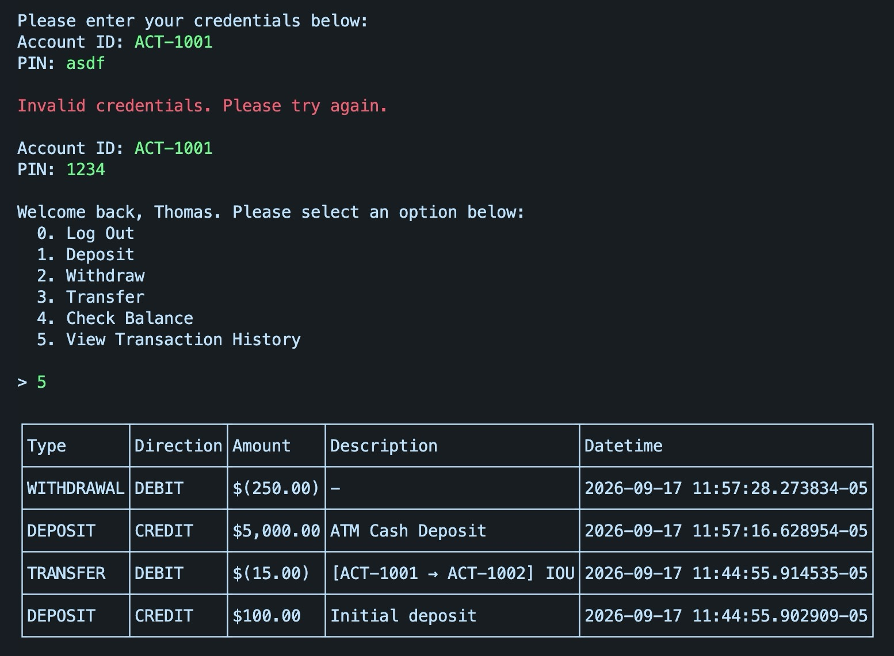

# Bank of CLI Project

## TODO

- Draw ERD.
- Logging (Don't need to put too much effort into logging).
- Testing (Single positive and single negative test in project).
- Setup instructions

```bash
cd /Users/thomas/Local/Revature/projects/p0/src/app ; /usr/bin/env /Library/Java/JavaVirtualMachines/jdk-19.jdk/Contents/Home/bin/java @/var/folders/ln/__v62bp94y3ctp_v34tw9s700000gn/T/cp_28x3g6vwcqhbl933sk1h2h3xx.argfile io.github.tthn0.app.Main
```

```
$$$$$$$\                      $$\                        $$$$$$\         $$$$$$\  $$\       $$$$$$\
$$  __$$\                     $$ |                      $$  __$$\       $$  __$$\ $$ |      \_$$  _|
$$ |  $$ | $$$$$$\  $$$$$$$\  $$ |  $$\        $$$$$$\  $$ /  \__|      $$ /  \__|$$ |        $$ |
$$$$$$$\ | \____$$\ $$  __$$\ $$ | $$  |      $$  __$$\ $$$$\           $$ |      $$ |        $$ |
$$  __$$\  $$$$$$$ |$$ |  $$ |$$$$$$  /       $$ /  $$ |$$  _|          $$ |      $$ |        $$ |
$$ |  $$ |$$  __$$ |$$ |  $$ |$$  _$$<        $$ |  $$ |$$ |            $$ |  $$\ $$ |        $$ |
$$$$$$$  |\$$$$$$$ |$$ |  $$ |$$ | \$$\       \$$$$$$  |$$ |            \$$$$$$  |$$$$$$$$\ $$$$$$\
\_______/  \_______|\__|  \__|\__|  \__|       \______/ \__|             \______/ \________|\______|
```



## About

- This repository features my first project built during my Revature full-stack software engineering training.
  - It is a minimal CLI REPL application using Java, Maven, JDBC, Junit, & PostgreSQL.
  - It features a fictional bank with limited functionality that allows users to create accounts, sign in, deposit, withdraw, transfer money, check their balance, and view their transaction history.
  - The database contains a double-entry ledger that closely mirrors real-world financial institutions to maintain accurate bookkeeping.
- Full instructions and rubric can be found [here](Instructions.md).

## Deliverables

- PostgreSQL Database w/ ERD.
- Banking CLI App With:
  - Clean Code Architecture.
  - Good Error Handling.
  - Basic Logging.
  - Basic Testing.
  - Transactions (For Maintaining Account Balance Integrity & Preventing Race Conditions).

## Setup

### 1. Start the database

```bash
docker run -d --name bank-of-cli -p 5432:5432 -e POSTGRES_USER=username -e POSTGRES_PASSWORD=password -e POSTGRES_DB=bank_of_cli postgres:17
```

### 2. Initialize the database

Import the initialization script ([`src/db/init.sql`](src/db/init.sql)) into your database, using any PostgresSQL client.

### 3. Run the application

```bash
cd src/app
mvn compile exec:java -Dexec.mainClass="io.github.tthn0.app.Main"
```

## Demo Steps

- App
  - Invalid Option
  - Create Account
    - PIN Validation
  - Login
    - With Wrong Password
    - With Correct Password
  - Account Menu
    - Invalid Option
    - (4) Check Balance
    - (5) View Transaction History
    - (2) Withdraw Large Amount
    - (1) Deposit $1000
    - (2) Withdraw $200
    - (4) Check Balance ($800)
    - (5) View Transaction History
    - (0) Log Out
  - Create Another Account
    - Login
    - (1) Deposit $500
    - (3) Transfer (To Invalid Account)
    - (3) Transfer $9999
    - (3) Transfer $25
    - (4) Check Balance
    - (5) View Transaction History
    - (0) Log Out
  - Login To First Account
    - (5) View Transaction History
    - (4) Check Balance
- Database
  - ERD
  - Double-Entry Ledger
    - Learned While Working at Paycom
    - Mimics Real-World Banking
    - Money Never Vanishes or Suddenly Appears
    - System Clearing Account
    - `SELECT SUM(amount) FROM ledger_entries;`
  - UDF
    - Transfer
    - Deposit/Withdraw
